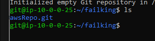
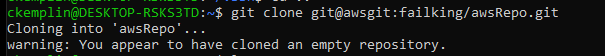

# My Project 1

## Setup:

1. remote into AWS instance and create user git and switch users to git

2. make directory .ssh and chmod 700 it

3. change directory into .ssh, create authorized_users file and chmod 600 

4. `mkdir failking` (to make command like URL command with creator in title)

5.  `nano .ssh/authorized_keys` and copy public key from ubuntu user over to this user.

6. change directory into `~/failking/` and `git init --bare repo`

7. create identity for ssh connection into the aws server inside `.ssh/config`

8. clone repo to my computer using `git clone git@awsgit:failking/awsRepo.git`

## Using the Repo:

1. On my local machine I need to change my git config to have my email and name to be able to commit.
    - using:
        - `git config --global user.name "Chris K"`
        - `git config --global user.email "kemplin.christopher@gmail.com"`

2. Navigate to the awsRepo on my local machine inside Ubuntu using WSL2

3. `touch sample.txt` and add some text to it just because.

### adding:

    - while inside the repo still, `git add sample.txt`

### commiting:

    - while inside the repo still, 'git commit -m "committing sample.txt"`

### pushing:

    -  while inside the repo still, `git push`

## The Pudding

