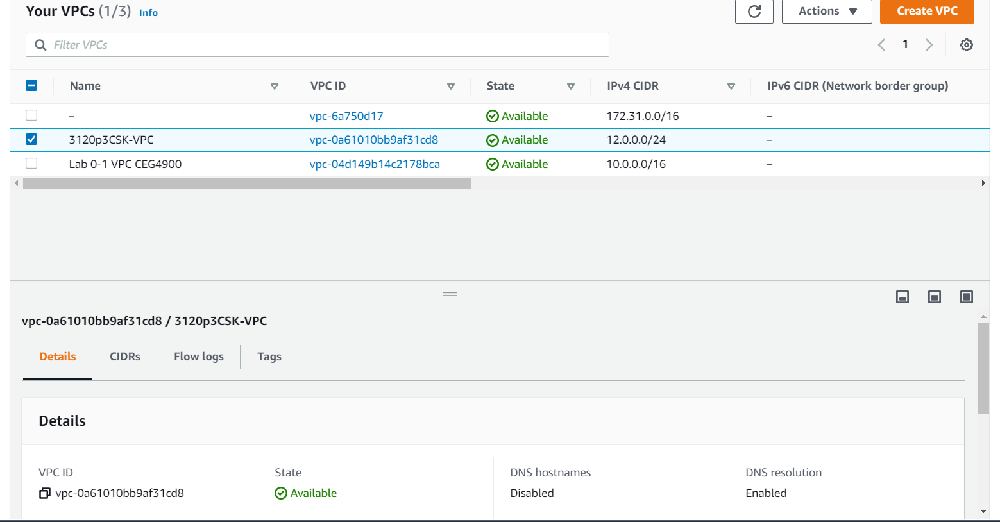
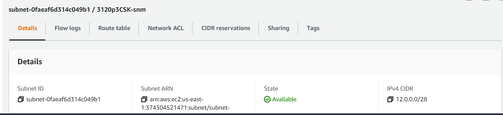
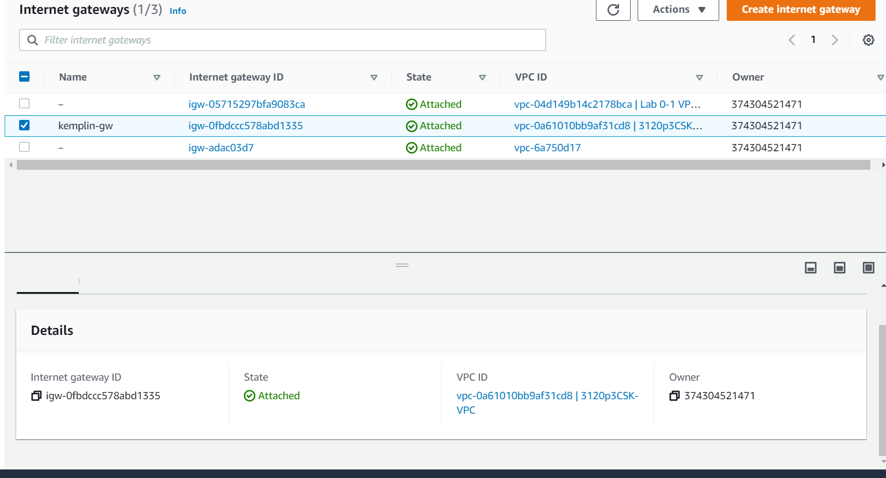
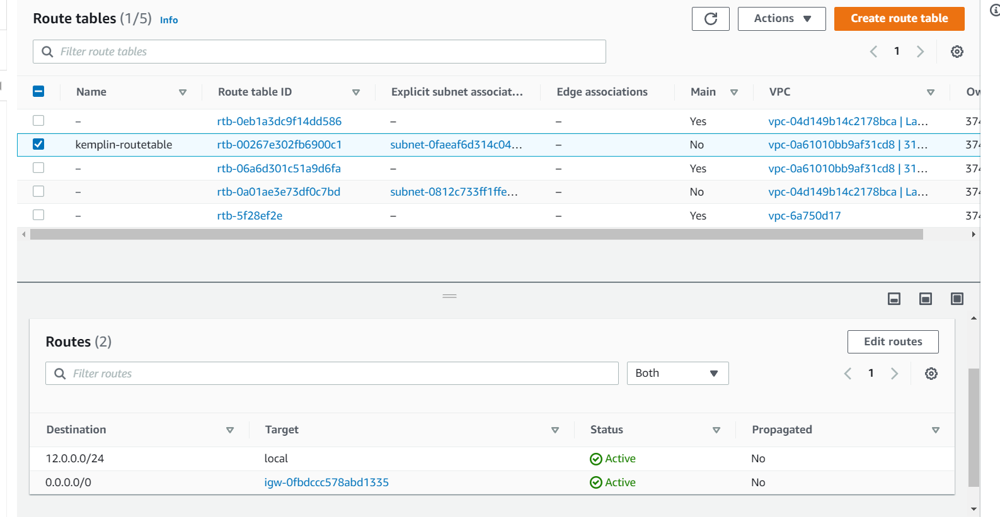
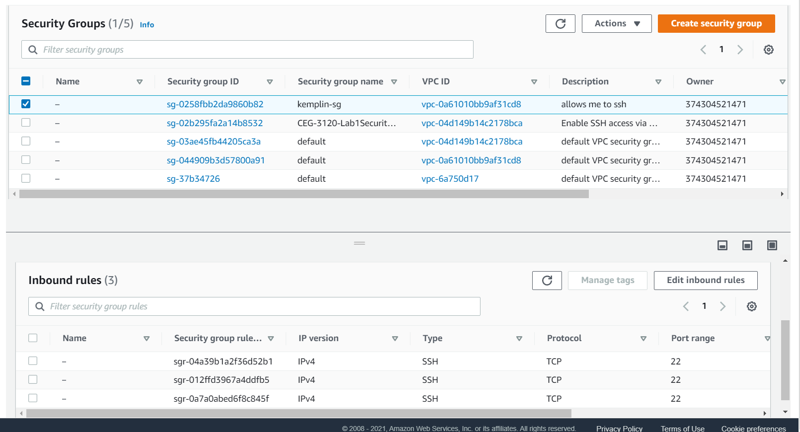

# Project 3

## Part 1

### VPC
###
1. The VPC reminds me of the router of a home network. The VPC is where you attach all of your rules, subnet masks, and gateways to essentially build a virtual network or cluster.

2. Image

### Subnet mask
###
1. A subnet mask declares how many digits of the IP are accessible for local devices, determining how many IP's are available on a network.

2. Image

### Gateway
###
1. The gateway is like its name implies, it is the gateway between the private network and the public network.  All traffic coming in to the and out of the network must pass through the gateway. The gateway converts public ip packets to local ip packets.

2. Image

### Route Table
###
1. The route table is a table of predefined routes that will be followed when the packets are addressed how the rule states, and it will be sent to the target.

2. Image

### Security Group
###
1. The security group sets a group set of rules that act much like a firewall would.  These rules can allow ssh traffic or just about any traffic that you know the protocol and/or the port for.

2. Image

## Part 2
###
1. Ubuntu is the default user id for ubuntu 20.04 LTS

2. In the configure instance stage of instance creation you must select the vpc you would like to use from the Network dropdown.

3. I do not want to allow them to auto assign me an IPv4 address because these addresses could be taken away from me at any moment if Amazon wanted to.  This could cause many issues, but in our case I would not be able to ssh in without finding the new IP.

4. In the add storage stage of instance creation I just created root with the default ssd type and 8gb storage.

5. In stage 5 of instance creation I created a Name tag that contains p3InstanceCSK (got ahead of myself and created this before actually reading there was an expected name)

6. In the security group tab I just selected choose from existing and then chose the security group I created from the list